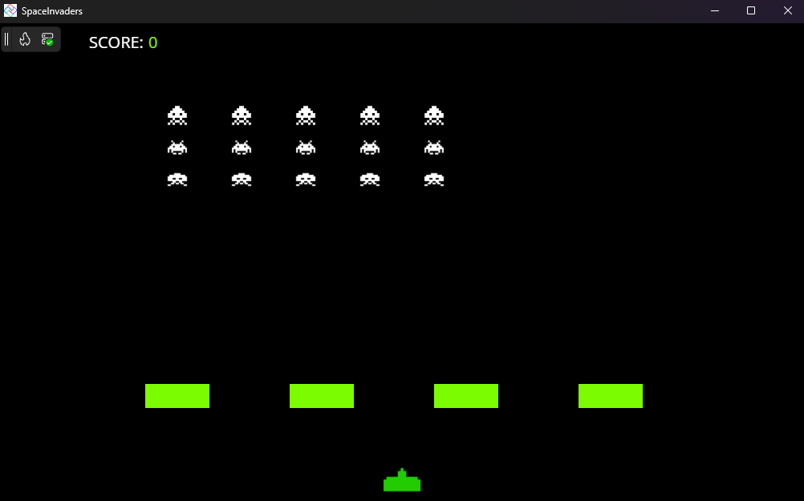

<<<<<<< HEAD
# Clone de Space Invaders (Primeira Fase)

Este projeto é uma recriação da primeira fase do clássico jogo de arcade *Space Invaders*, desenvolvido como parte de um módulo de estudo de programação. O objetivo principal foi implementar as mecânicas fundamentais do jogo utilizando uma estrutura de código limpa e orientada a objetos em C# com a Plataforma Uno.

## ✨ Funcionalidades Implementadas

* **Tela Inicial Completa:** Um menu principal com três opções claras:
    * Iniciar um novo jogo.
    * Ver a tabela com os placares salvos.
    * Ver os controles do jogo.
* **Sistema de Placares Persistente:** As 10 melhores pontuações são salvas em um arquivo de texto local (`highscores.txt`), garantindo que os recordes persistam entre as sessões de jogo.
* **Inimigos Estáticos em Ondas:** Conforme os requisitos da primeira fase, os aliens aparecem em uma formação fixa. Ao destruir todos, uma nova onda é gerada.
* **Controles do Jogador:** O jogador pode mover a nave horizontalmente e atirar. Apenas um tiro pode estar na tela por vez.
* **Escudos Destrutíveis:** Quatro escudos protegem o jogador e se deterioram visualmente ao serem atingidos.
* **Efeitos Sonoros:** Cada ação principal possui um som correspondente:
    * Música de fundo na tela inicial.
    * Som de tiro do jogador.
    * Som de acerto ao destruir um inimigo.
* **Condição de Vitória:** O jogo é vencido quando o jogador atinge **500 pontos**.

## 🚀 Tecnologias Utilizadas

* **C# e .NET:** Linguagem e plataforma principal para toda a lógica do jogo.
* **Uno Platform (com WinUI 3):** Framework utilizado para a criação da interface gráfica (UI).
* **NAudio:** Biblioteca de áudio externa robusta, utilizada para garantir a reprodução confiável dos efeitos sonoros e da música no ambiente Windows.

## 📂 Estrutura do Projeto

O código foi refatorado para seguir os princípios da Programação Orientada a Objetos, com responsabilidades bem definidas para cada classe.

* **Assets/**
    * **Images/**
        * `(Seus arquivos de imagem .png)`
* **Models/**
    * `Barrier.cs`
    * `Enemy.cs`
    * `EnemyType.cs`
    * `GameObject.cs`
    * `Player.cs`
* **Services/**
    * `EnemyManager.cs`
    * `HighScoreManager.cs`
    * `SoundManager.cs`
* **Sounds/**
    * `(Seus arquivos de áudio .wav, .mp3, etc.)`
* `MainPage.xaml`
* `MainPage.xaml.cs`
* `(Outros arquivos de projeto)`

  
## 🛠️ Como Executar

**Pré-requisitos:**
* SDK do .NET 8 (ou superior).
* Um ambiente de desenvolvimento como **Visual Studio 2022** ou **JetBrains Rider**.

**Passos:**
1.  Clone ou baixe este repositório.
2.  Abra o arquivo da solução (`.sln`) no seu ambiente de desenvolvimento.
3.  Restaure os pacotes NuGet (o ambiente deve fazer isso automaticamente).
4.  Selecione o projeto de inicialização (ex: `SpaceInvaders.Skia.Wpf` para Windows).
5.  Execute o projeto.

## 🎮 Controles

* **Mover:** Setas Direita/Esquerda ou Teclas A/D
* **Atirar:** Barra de Espaço

---

**Autor:**
[Diogo Santos Cruz]
=======

